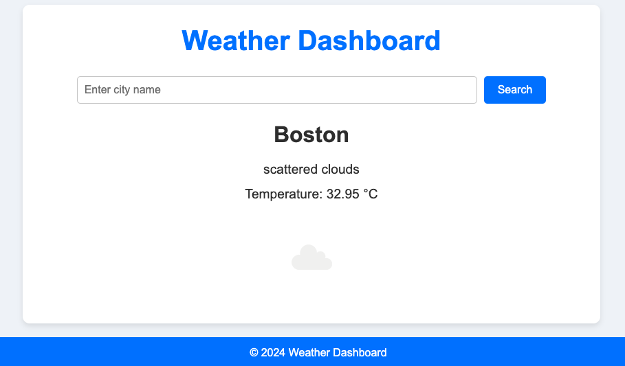

# Weather Dashboard

## Overview

The Weather Dashboard is a Flask-based web application that allows users to check the current weather conditions for any city. The application uses the OpenWeatherMap API to fetch weather data and presents it in a user-friendly interface with animations and a responsive design.

## Features

- Search for current weather conditions by city name.
- Display temperature, weather description, and icon.
- Animated and responsive UI.
- Built using Flask, HTML, CSS.

## Prerequisites

- Python 3.6 or higher
- Flask
- OpenWeatherMap API Key

## Installation

1. Clone the repository:
   ```bash
   git clone https://github.com/gouthamyadavalli/weather-dashboard.git
   cd weather-dashboard


2. Set up a virtual environment and install dependencies:
    ```bash
    API_KEY = 'your_openweathermap_api_key_here'
    ```
3. Add your OpenWeatherMap API key in the `config.py` file:
    ```python
    class Config:
    SECRET_KEY = 'your_secret_key'
    SQLALCHEMY_DATABASE_URI = 'sqlite:///todo.db'
    SQLALCHEMY_TRACK_MODIFICATIONS = False
    ```
4. Initialise the database:
    ```
    flask shell
    from app import db
    db.create_all()
    exit()
    ```
4. Run the application:
    ```bash
    flask run
    ```
5. Open your browser and navigate to `http://127.0.0.1:5000/` to use the Weather Dashboard.

## Usage
 - Enter a city name into the input field and click "Search" to view the current weather conditions for that city.


